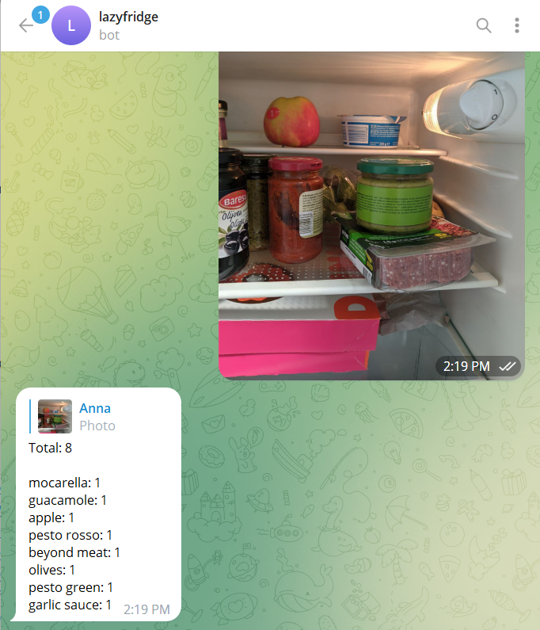
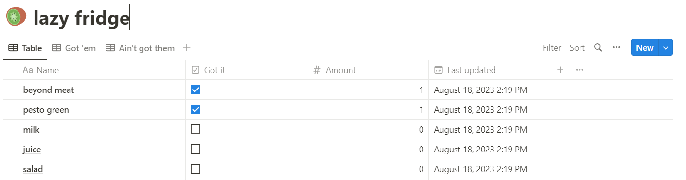
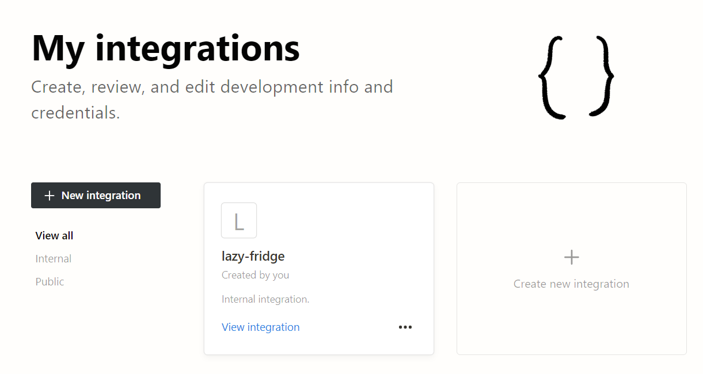
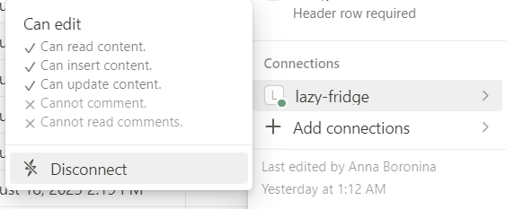

This is a personal pet project to detect what I have in the fridge. We used to have a Notion database that we had to update manually. This project is an attempt to change it :)

The dataset is limited to my fridge, and YOLOv8 gets retrained as the dataset grows.

Example of this bot's work:



For running, this project requires there environmental variables:

```
TELEGRAM_TOKEN
NOTION_TOKEN
DATABASE_ID
```

The `DATABASE_ID` must be the id of the Notion database you want to use for the bot. The database must have these columns:

- Name (title)
- Got it (type: checkbox)
- Amount (type: number)
- Last updated (type: date)

Example of the database is below.



Note that NOTION_TOKEN must be created on [Notion's integrations page](https://www.notion.so/my-integrations).



And then the newly created integration must be added to the chosen database's connections. You can find it by clicking on three dots in the upper right corner of the Notion's page.

